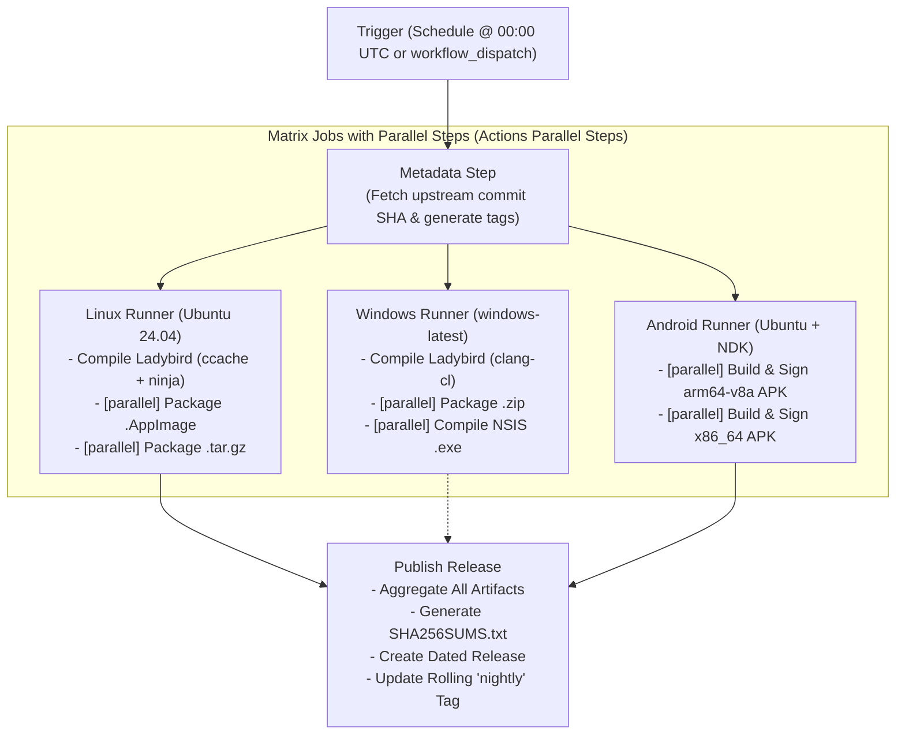

# 🐞 Ladybird Browser Automated Builds (GitHub Actions)

[](https://github.com/ikafly144/ladybird-builds/actions/workflows/nightly-release.yml)
[](LICENSE)
[](https://github.com/ikafly144/ladybird-builds/releases)

Automated GitHub Actions CI/CD repository for building and releasing [Ladybird Browser](https://github.com/LadybirdBrowser/ladybird) on **Linux**, **Windows**, and **Android**.

---

## 🎯 Supported Platforms & Release Assets

Every nightly or manual build produces the following binary assets with automated SHA-256 checksums:

| Platform | Format | Asset Name | Status |
| :--- | :--- | :--- | :--- |
| **Linux (x86_64)** | **AppImage** | `Ladybird-Linux-x86_64.AppImage` | 🟢 Stable |
| **Linux (x86_64)** | **Tarball** | `Ladybird-Linux-x86_64.tar.gz` | 🟢 Stable |
| **Windows (x86_64)** | **NSIS Installer** | `Ladybird-Setup-x86_64.exe` | 🟡 Experimental |
| **Windows (x86_64)** | **Portable ZIP** | `Ladybird-Windows-x86_64.zip` | 🟡 Experimental |
| **Android (arm64-v8a)** | **APK** | `Ladybird-Android-arm64-v8a.apk` | 🟢 Ready |
| **Android (x86_64)** | **APK** | `Ladybird-Android-x86_64.apk` | 🟢 Ready |

---

## 🏗️ Architecture & Workflow Pipeline



---

## 🚀 Getting Started / Setup

### 1. Fork or Clone this Repository
Push this repository to your GitHub account:
```sh
git clone https://github.com/ikafly144/ladybird-builds.git
cd ladybird-builds
git remote set-url origin https://github.com/ikafly144/ladybird-builds.git
git push -u origin main
```

### 2. Enable GitHub Actions Permissions
To allow GitHub Actions to create releases and upload binary assets:
1. Go to your repository on GitHub: **Settings > Actions > General**.
2. Under **Workflow permissions**, select **"Read and write permissions"**.
3. Check the box **"Allow GitHub Actions to create and approve pull requests"**.
4. Click **Save**.

### 3. (Optional) Configure Android Release Signing
By default, Android APKs are signed with a standard debug key so they are immediately installable on any Android device.

If you want to sign APKs with your own Release Keystore, configure the following [GitHub Actions Secrets](https://docs.github.com/en/actions/security-guides/encrypted-secrets):
* `ANDROID_KEYSTORE_BASE64`: Base64-encoded `.keystore` / `.jks` file:
  ```sh
  base64 -w 0 my-release-key.keystore
  ```
* `ANDROID_KEYSTORE_PASSWORD`: Keystore password.
* `ANDROID_KEY_ALIAS`: Keystore key alias.
* `ANDROID_KEY_PASSWORD`: Key password.

---

## ⚙️ Manual Build & Customization (`workflow_dispatch`)

You can trigger a custom build on demand with full control over the build parameters:

1. Navigate to the **Actions** tab in GitHub.
2. Select **"Ladybird Custom / Manual Release"** or **"Ladybird Nightly Release"**.
3. Click **"Run workflow"** and specify:
   * **Upstream Repository**: `LadybirdBrowser/ladybird` (or your custom fork URL).
   * **Branch / Ref / SHA**: `master`, `v0.1.0`, or a specific commit hash.
   * **Platform Toggles**: Selectively enable/disable Linux, Windows, or Android builds.
   * **Release Tag / Pre-release status**.

---

## 📂 Repository Structure

```
.
├── .github/
│   └── workflows/
│       ├── nightly-release.yml    # Daily automated scheduled release
│       ├── manual-release.yml     # On-demand customizable build & release
│       └── ci.yml                 # Script validation and linting
├── packaging/
│   ├── linux/
│   │   ├── AppRun                 # AppImage runtime entrypoint
│   │   ├── ladybird.desktop       # Desktop entry descriptor
│   │   └── package-linux.sh       # Linux packaging script (.AppImage & .tar.gz)
│   ├── windows/
│   │   ├── installer.nsi          # NSIS installer definition script
│   │   └── package-windows.sh     # Windows packaging script (.exe & .zip)
│   └── android/
│       └── package-android.sh     # Android build & APK signing script
├── scripts/
│   ├── check-upstream.sh          # Resolves commit SHA & outputs build parameters
│   ├── generate-changelog.sh      # Generates markdown changelog with SHA256 table
│   └── setup-ccache.sh            # Configures ccache for build acceleration
├── .gitignore
├── LICENSE                        # BSD 2-Clause License
└── README.md
```

---

## ⚡ Build Acceleration & Caching

To keep CI runtimes within GitHub Actions limits, the workflows integrate multi-tier caching:
* **Ccache**: Persists compiled C++ object files across builds.
* **vcpkg Binary Cache**: Avoids rebuilding third-party dependencies from scratch.
* **Gradle / NDK Cache**: Accelerates Android builds.

---

## 📜 License

This repository is licensed under the [BSD 2-Clause License](LICENSE), matching the upstream Ladybird project.
Ladybird is an independent project by the Ladybird Browser Project and contributors.
